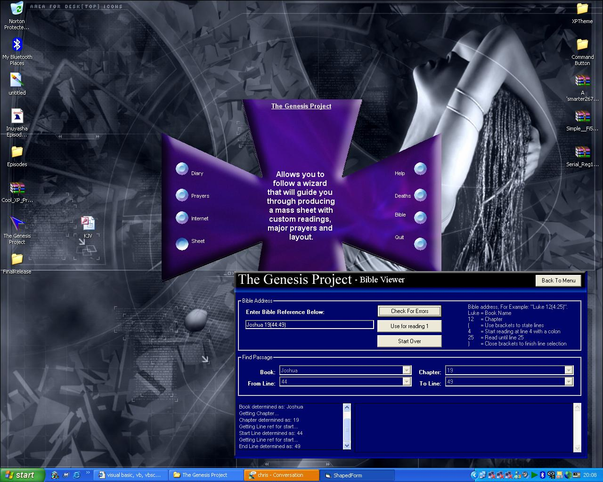



## bible search database

### Description

links to the bible allowing searching and indexing of indervidual passages, works using sql and select statements. Program also demonstrates web browser integration and use of the flex grid and shaped forms. you can either select a bible passages or sub chapter etc... or you can enter a passage using the global format, example:

Genesis 5(5:9)

NOTE ALL BOOKS HAVE A CAPITAL LETTER AND SEARCHES ARE CASE SENSITIVE.There are a few bugs still in this program in relation to back to menu buttons mid wizard and stuff, so be carefull.
 
### More Info
 

             |
---                |---
**Submitted On**   |2004-05-28 05:58:34
**By**             |[Jordon Pilling](https://github.com/Planet-Source-Code/PSCIndex/blob/master/ByAuthor/jordon-pilling.md)
**Level**          |Intermediate
**User Rating**    |5.0 (25 globes from 5 users)
**Compatibility**  |VB 6\.0
**Category**       |[Databases/ Data Access/ DAO/ ADO](https://github.com/Planet-Source-Code/PSCIndex/blob/master/ByCategory/databases-data-access-dao-ado__1-6.md)
**World**          |[Visual Basic](https://github.com/Planet-Source-Code/PSCIndex/blob/master/ByWorld/visual-basic.md)
**Archive File**   |[bible\_sear1824321222004\.zip](https://github.com/Planet-Source-Code/jordon-pilling-bible-search-database__1-57512/archive/master.zip)

